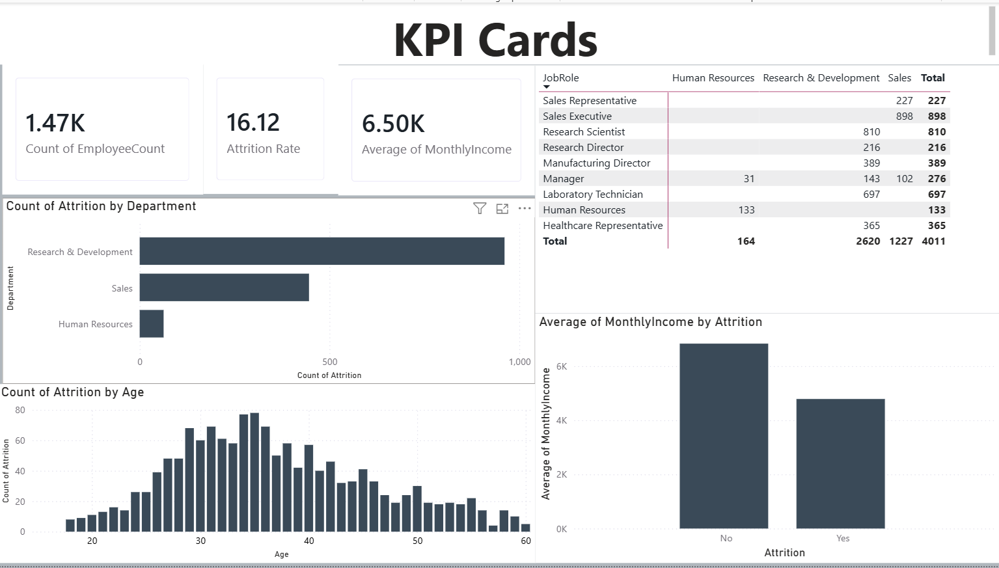

# HR Analytics Dashboard - Power BI

## Project Overview
An interactive HR Analytics dashboard built in Power BI analyzing 
employee attrition, salary trends, job satisfaction, and workforce 
demographics using the IBM HR Analytics dataset (1,470 employees).

## Tools Used
- Power BI Desktop
- DAX (Data Analysis Expressions)
- Microsoft Excel / CSV data

## Key Findings
- Overall attrition rate: **16.12%**
- **Research & Development** had the highest attrition among all departments
- Employees aged **30–35** showed the highest attrition rate
- **Research Directors** had the lowest job satisfaction score
- Employees who left earned significantly **lower average salaries** 
  than those who stayed
- Workforce is **60% male** and 40% female

## Dashboard Pages
- **Page 1:** KPI Cards, Attrition by Department, Attrition by Age, 
  Job Satisfaction Matrix, Salary vs Attrition
- **Page 2:** Gender breakdown and Department slicer

## Dashboard Preview

